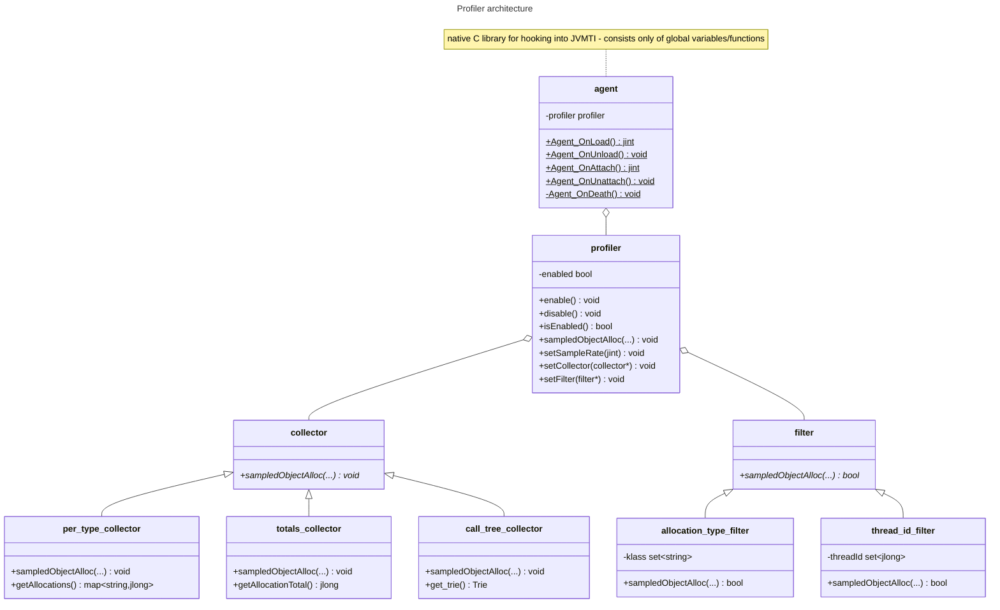

# Code hierarchy and dependencies

This document describes the profiler architecture and class model, both the C++ and Java aspects of the library.

## C++

When the profiler is loaded or attached using the JVMTI interface to the JVM, the agent will start up, ascertain that the
underlying JVM has capabilities for `can_generate_sampled_object_alloc_events`, and if it does, allocate the profiler.
The profiler will, unless specified otherwise in agent options, start up in a disabled state.

The profiler can only be enabled if a collector is configured, otherwise it will fail. Filters are optional and can be used
if you only want to track certain threads or classes.

Once enabled, every sampled allocation (default: all allocations), will be first run through a filter (if any), and then sent
to the collector.

After disabling the profiler, the test can read out relevant parts from the collectors in order to report on them.

If using the profiler interface from Java while it is enabled should be done with care as it can potentially cause a
`StackOverflowException` if the called code allocates.

## Java

Each of the C++ classes above has a Java-native class fronting the underlying C++ class in order to facilitate
use from the Java library (documented in its own repository).

These classes are named, e.g., `NativeAllocationTypeFilter` to correspond with `allocation_type_filter` and so on.

Only fields and method that are relevant for the Java code to use is exposed, i.e. `sampledObjectAlloc` is not exposed
to the Java world, whereas the query methods for allocations, and the filtered properties are.
